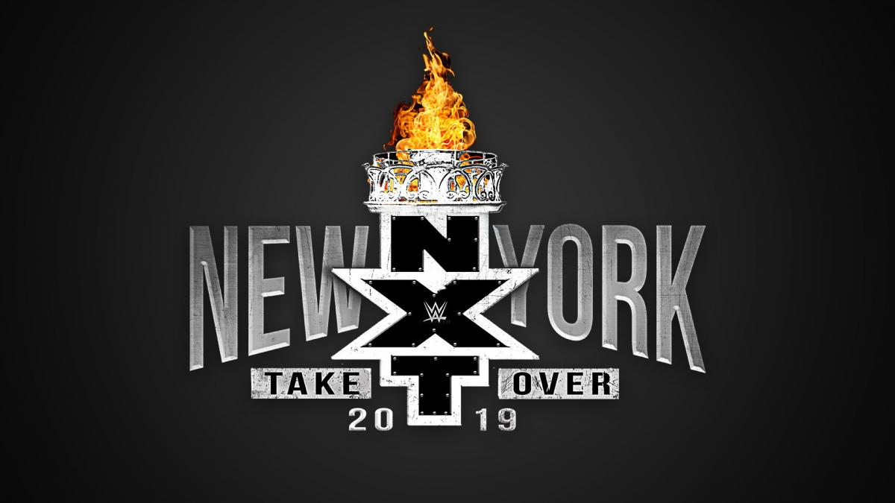
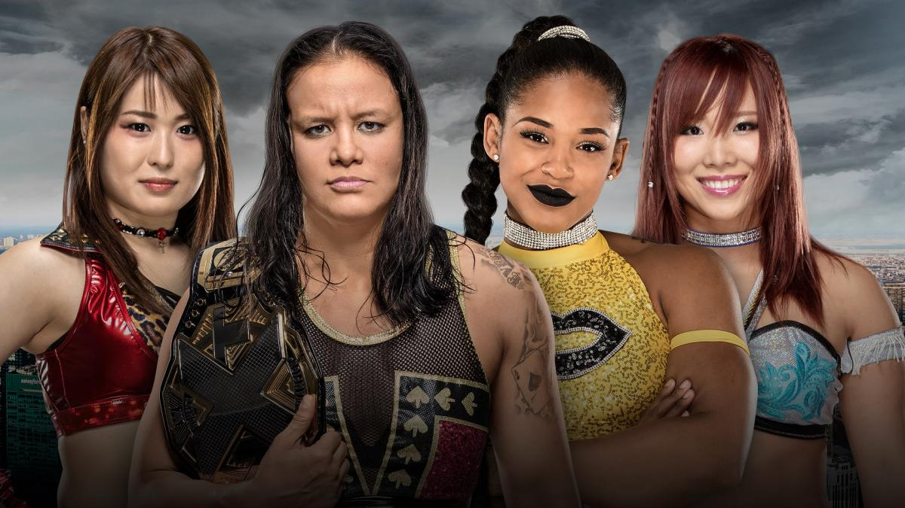

# NXT TakeOver:Phoenix

>日期：2019.04.05
>
>地点：纽约，布鲁克林，巴克莱中心

### NXT Championship 2-out-of-3 Falls Match
Johnny Gargano vs. Adam Cole

### NXT Women’s Championship Fatal 4-Way Match
Shayna Baszler (c) vs. Kairi Sane vs. Io Shirai vs. Bianca Belair 

### WWE United Kingdom Championship Match
Pete Dunne (c) vs. WALTER 

### NXT Tag Team Championship Match
The War Raiders (c) vs. Aleister Black & Ricochet

### NXT North American Championship Match
Velveteen Dream (c) vs. Matt Riddle

### 赛果：
- The War Raiders 战胜 Aleister Black & Ricochet 卫冕 NXT双打冠军
- Velveteen Dream 战胜 Matt Riddle 卫冕 NXT北美冠军 
- WALTER 战胜 Pete Dunne 成为新科 WWE英国冠军
- Shayna Baszler 战胜 Bianca Belair, Io Shirai & Kairi Sane  卫冕 NXT女子冠军
- Johnny Gargano 战胜 Adam Cole 成为新科 NXT冠军
